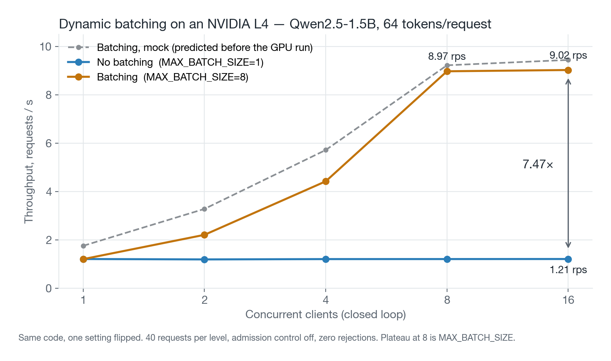
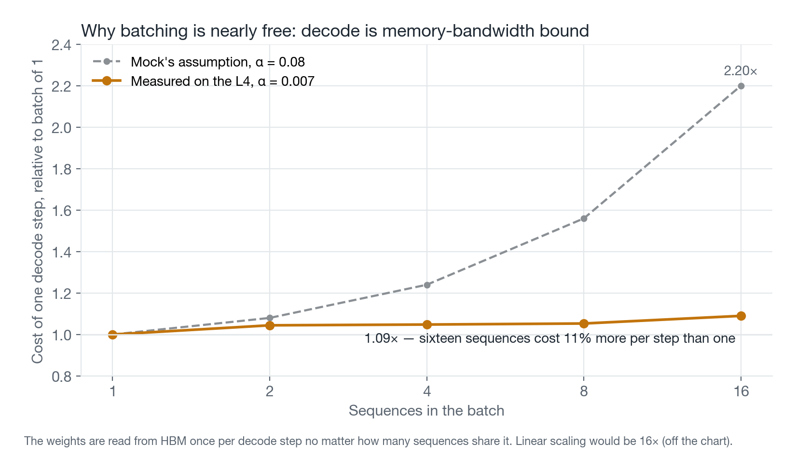
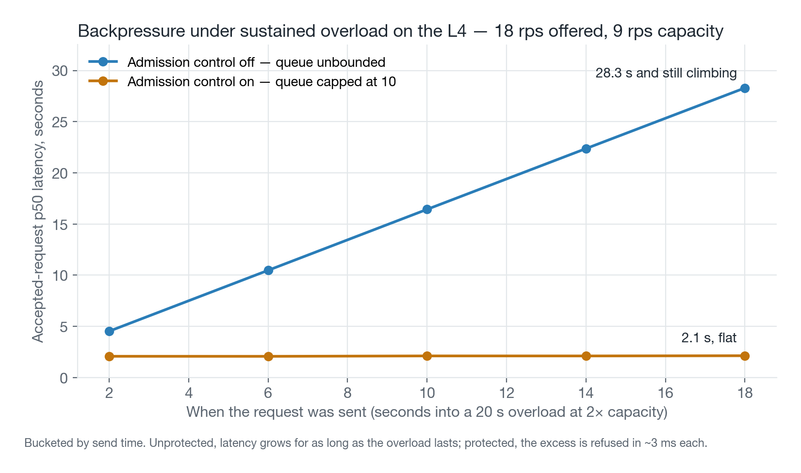
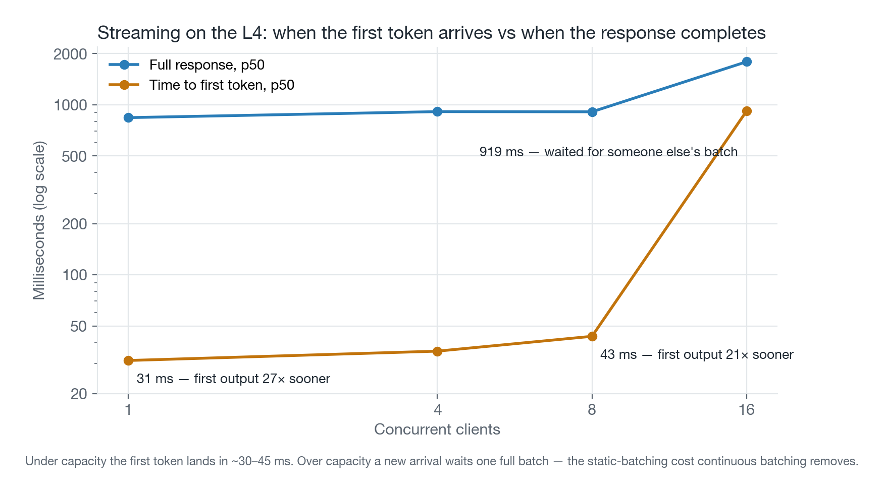
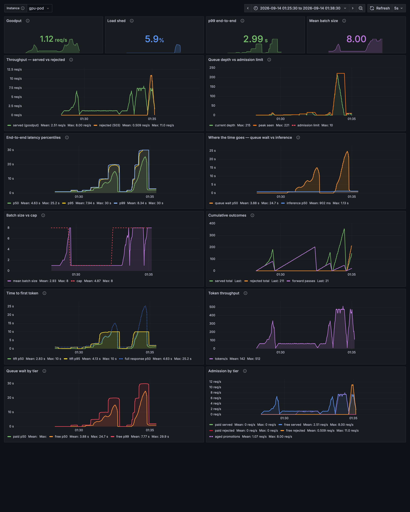

# LLM Inference Serving Layer

A single-node serving layer for a small open-weight LLM — request queueing,
dynamic batching, admission control, token streaming, and priority scheduling —
built mock-first, then measured on a real GPU. Every claim below has a control
condition next to it.

**Live demo:** https://llm-serving-demo.onrender.com/docs · **Build log:**
[docs/BUILD_LOG.md](docs/BUILD_LOG.md)

## Results — Qwen2.5-1.5B-Instruct on an NVIDIA L4

| | Measured |
| --- | ---: |
| **Throughput, batching vs. one-at-a-time, 16 concurrent** | **7.47×** (1.21 → 9.02 rps) |
| **p50 latency at 16 concurrent** | **13.2 s → 1.76 s** |
| **p99 under 2× overload, admission control off → on** | **31.0 s → 2.98 s** |
| **Time to first token, streaming** | **31 ms** (full response: 840 ms) |
| **Cost of one decode step, batch of 16 vs. batch of 1** | **1.11×** |
| Total GPU spend, whole project | ≈ $0.45 |



Same code, one setting flipped, admission control disabled for both runs, zero
rejections in either. The dashed line is what the mock predicted before the GPU
run; real hardware beat it.

## What it is

```
client ──HTTP──▶ FastAPI ──▶ TieredQueue ──▶ scheduler loop ──▶ single inference thread
                    │              │                │                    │
                    │         admission         batch when            model
                    │         (503 if full)     full OR 10 ms          (mock | Qwen)
                    │                                │                    │
                    ◀────── Future (whole response) ─┴─ SSE (per token) ──┘
```

- **Queue + dynamic batching.** Requests park on a queue; one scheduler task
  groups them and runs a single forward pass per batch. Dispatch when the batch
  is full *or* a 10 ms deadline passes — the deadline only costs latency when
  the system has capacity to spare.
- **Admission control.** Past a queue depth *derived from a latency budget*,
  new requests get a fast `503` + `Retry-After` instead of a slow yes.
- **Streaming.** `"stream": true` returns Server-Sent Events, one per token.
  Batching and streaming aren't in tension: every decode step advances every
  sequence in the batch, so tokens fan out per step.
- **Priority tiers with aging.** Paid before free, free refused at a shallower
  depth, and a free request that has waited `AGING_MS` is promoted so it
  cannot starve.
- **Observability.** Per-request JSONL (the audit trail) plus Prometheus
  metrics and an auto-provisioned Grafana dashboard (the live view). They
  answer different questions and both are kept.
- **One command, anywhere.** `docker compose up` brings up app + Prometheus +
  Grafana in ~6 s. The same image ran on the GPU rental.

Python · FastAPI · asyncio · Hugging Face transformers · Prometheus · Grafana ·
Docker · Render · RunPod.

## How each result was measured

### Batching: 7.47× — and why it's nearly free



Generating one token means reading every model weight out of GPU memory —
~3 GB — and that read costs the same whether one sequence or sixteen share it.
On the L4, sixteen sequences cost **11% more per step** than one; the mock's
guess of 56% for eight was ten times too pessimistic. Decode is
memory-bandwidth bound, and batching is how you stop paying the read sixteen
times over.

Latency *improved* under batching even though each pass does more work, because
above one concurrent client latency was queue wait, not inference. Draining the
queue 7× faster removes far more waiting than the wider batch adds.

### Backpressure: bounded latency at ~5% goodput cost



The threshold isn't a guess. Queue depth converts to promised latency at
`batch_time / batch_size` per queued request, so for a 2.5 s p99 target on the
L4: `(2500 − 1090) × 8 / 1090 = 10`. Measured p99 came in at 2.98 s — 19% over,
because the formula ignores the batch already in flight and real hardware
varies more than a sleep. Unprotected, the queue reached 220 and p99 hit 31 s.

Goodput was 7.09 rps unprotected vs. 6.75 protected. The unprotected server was
never doing *more* work — it was doing the same work while holding 220 requests
hostage. A client refused in 3 ms can retry or fail over; one that waits 30 s
has already timed out, and the GPU burned a pass on an answer nobody reads.

`503` rather than `429`: the check is global queue depth, not per-client, so a
caller's very first request is refused if it lands at a bad moment. That's
server capacity, which is what 503 means. Behind a load balancer that ejects on
503, switch to 429 — TGI does.

### Streaming: first token in 31 ms



Under capacity the first token lands in 31–44 ms — prefill plus one decode
step — while the full response takes ~900 ms. Throughput is identical with or
without streaming: it changes *when* bytes arrive, not how much work is done.

Over capacity, TTFT jumps by one full batch (~890 ms). Batches here are
**static**: once one starts, nobody joins until it ends, so a request arriving
mid-batch waits for someone else's generation to finish. Continuous batching
(vLLM, TGI) admits arrivals at the next decode step instead, ~16 ms away. Out of
scope; measured rather than hidden.

### Priority tiers: shed the right load, and don't starve anyone

Under overload with tiered admission, **the same 147 requests were accepted**
as with flat admission — shifted from free to paid (paid 42% → 50%, free 38% →
18%). Tiering doesn't add capacity; it decides whose work gets done.

Strict priority starves: with paid traffic at capacity and aging off, free
requests waited up to **5.5 s** in the queue; with aging on, **2.2 s**, under
the predicted bound of `AGING_MS + one batch`. The cost is real — each promoted
free request takes a slot from paid — and `AGING_MS` is the dial.

## Dashboard



Both GPU sessions as Prometheus recorded them. The panel that matters most is
*Where the time goes*: inference p50 is a flat line at ~1 s across everything
while queue wait spikes to 25 s. The model was never the problem; the line was.

`ops/verify_dashboards.py` reads the PromQL out of the dashboard JSON and runs
it against Prometheus, so a passing run proves the panels — not some parallel
set of queries. It caught a real bug: p99 reading 2.93 s where the load test
measured 2.53 s, because histogram buckets straddled exactly the SLO the
admission threshold was derived from. Buckets belong where the decisions are.

## Design decisions worth defending

**The mock serializes.** Both backends are blocking functions on a
one-worker thread. An `await asyncio.sleep()` mock would let N requests "infer"
in parallel, fake linear scaling, and make batching look like a regression
against a baseline no GPU could produce. `max_workers=1` is the physical
constraint written into the code.

**Every comparison is a control run on the same code.** `MAX_BATCH_SIZE=1`
reproduces the no-batching baseline; `MAX_QUEUE_DEPTH=0` disables admission;
`AGING_MS=0` disables aging. Before/after numbers come from one binary with one
setting flipped, never from two commits.

**Mock first, GPU last.** Phases 1–5 ran against a sleep with a two-part cost
model (prefill + per-token × batch factor). Phase 6 measured the real curve and
found the shape right and the magnitude conservative. The mock's defaults are
now the L4-calibrated values.

**The queue is a scanned list, not a heap.** Aging means a job's priority
changes while it sits there; a heap orders by a key fixed at insertion and
cannot express that. Admission control bounds the queue at 10, so the scan is
free.

**One thread hop per decode step, not per token per client.** The backend
generator runs on the inference thread; each step crosses to the event loop
once via `call_soon_threadsafe` and fans out to every job in the batch. Tokens
are stamped when they existed, not when the loop got to them.

**Logging after delivery.** Every client is answered before anything is
written to disk, so logging is never inside the latency being measured.

**Zero and absent are different.** A Prometheus counter that hasn't been
incremented doesn't read 0 — it doesn't exist, and `rate()` over a series that
appears mid-window undercounts. Every label value is materialised at startup.

## What went wrong

The mistakes are half the value.

- **`time.sleep()` overshoots, and it compounds.** Splitting one 840 ms sleep
  into 64 per-token sleeps added 20% — enough to fail the batching regression
  check for a reason unrelated to the design. Fixed by sleeping to absolute
  deadlines.
- **The dashboard lied about the one number that mattered.** See above.
- **A `pip install torch` in 2026 gives you CUDA 13.** The host driver didn't
  support it; the pod crash-looped every 40 s while the provider's log API
  returned 404. The Mac dry run couldn't have caught it — MPS never touches
  CUDA. ~$0.10.
- **The runtime CUDA image has no C compiler**, and `transformers` 5.x
  JIT-compiles Triton kernels on first use. ~$0.05.
- **`| tee` masked a failed calibration**, so the sweep derived a queue depth
  of 64 from an empty string and load-tested a server returning 500s. Now every
  server start is followed by one real request that must return 200.
- **Adding priority tiers silently broke "admission off".** Requests default
  to `tier=free` with its own queue limit, so `MAX_QUEUE_DEPTH=0` stopped
  meaning what it meant. The backpressure OFF and ON runs came back identical —
  the only reason it was caught. ~$0.15 for the re-run. *An experiment that
  runs is not an experiment that measured what you meant.*
- **`MAX_WAIT_MS=10` is too tight for real networks.** Streaming clients
  re-send a few ms apart; a 10 ms window fragments what should be one batch. On
  the mock the spread is zero. The window is a function of arrival spread, not
  a constant.

## Future work

- **Continuous batching** — admit new sequences at decode-step boundaries.
  Would turn the over-capacity TTFT from ~900 ms to ~50 ms and reclaim slots
  from early-finishing sequences.
- **CUDA graphs / fused kernels** — the L4's bandwidth floor for these weights
  is ~10 ms/token; the Python decode loop measured 16. That gap is what vLLM
  closes.
- **`MAX_BATCH_SIZE=16`** — the calibration says it's nearly free on the L4.
- **Multi-replica** — explicitly out of scope. Everything here is one node,
  one model instance.

## Running it

```bash
docker compose up -d --build      # app :8000, Grafana :3000, Prometheus :9090
```

```bash
curl -X POST localhost:8000/generate -H 'content-type: application/json' \
  -d '{"prompt": "hello", "max_tokens": 32, "stream": true, "tier": "paid"}'
```

Every setting is an environment variable; see `app/config.py`. The control
runs are one override each:

```bash
MAX_BATCH_SIZE=1  docker compose up -d app    # no batching
MAX_QUEUE_DEPTH=0 MAX_QUEUE_DEPTH_FREE=0 docker compose up -d app   # no admission
```

Load tests — closed-loop for saturation, open-loop for overload, mixed-tier for
priority:

```bash
python -m bench.loadtest --concurrency 1,2,4,8,16 --requests 40 [--stream]
python -m bench.burst    --rate 20 --duration 20
python -m bench.tiers    --paid 14 --free 4 --duration 20
python -m bench.compare  --before A_summary.csv --after B_summary.csv
```

Real model on your own GPU: `BACKEND=qwen` with `requirements-model.txt`
installed, or the CI-built image `ghcr.io/jay-41/llm-serving-gpu`. The full
unattended benchmark session is `bench/phase6_sweep.sh --auto`; the runbook is
[ops/RUNPOD.md](ops/RUNPOD.md).

## Repository

```
app/            serving layer: config, backends, scheduler, telemetry, HTTP
bench/          load generators, calibration probe, benchmark session, charts
bench/results/  every CSV from every run, mock and GPU
logs/           per-request JSONL evidence for every experiment
ops/            Prometheus + Grafana config, dashboard verification, runbook
docs/           build log, charts, screenshots
Dockerfile      CPU image (the deploy)    Dockerfile.gpu   CUDA image (the benchmark)
render.yaml     the live demo             docker-compose.yml   the local stack
```

Built in phases, one commit per phase, each commit message carrying the
verified numbers. The [build log](docs/BUILD_LOG.md) has every table and every
control run.
